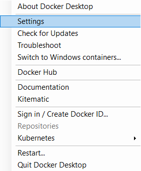
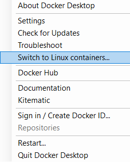
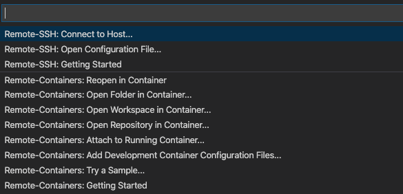

# Prerequisites

> Note you need an Azure subscription for this training. If you haven't signed
> up for Azure, please do so now. Go to
> [Create your Azure free account today](https://azure.microsoft.com/en-us/free/)

You have 2 options to satisfy the prerequisites needed to complete this training.

1. [Docker Container option](#docker-container-option)
1. [Alternate option](#alternate-option)

## Docker Container option

1. Install Visual Studio Code (VSCode)
1. Install the Remote Containers extension for VSCode
1. Install Docker Desktop
1. Run the Docker container
1. Log into Azure
1. Set your default subscription

### Install Visual Studio Code (VSCode)

Open your browser to [Download Visual Studio Code](https://code.visualstudio.com/Download).

Click on the button appropriate for your OS and install VSCode

### Install the Remote Containers extension for VSCode

Open your browser to [Remote - Containers](https://marketplace.visualstudio.com/items?itemName=ms-vscode-remote.remote-containers)


Click on the `Install` button.

It will ask you if you want to open this URL in VSCode.

Confirm that you want to open it in VSCode.


Click on the `Install` button.

*Note if you do not see the `Install` button you already have the extension
installed and you can continue on*

### Install Docker

*Note if you do not have a Docker ID yet you will need to sign up for one as you
will need it to download the Docker Desktop*

**Note you DO NOT have to go through the Docker tutorial, you only need to
download the Docker Desktop installer and then install Docker Desktop**

*Note if at any time you are asked to reboot your machine please do so*

Go to [Get Started with Docker](https://www.docker.com/get-started)

And follow the directions there.

### Run the Docker container

#### If you are running on a non-Windows OS

Replace `DIRECTORY` below with the base directory of the training material.

And execute the command line:

```shell
docker run --name devenv -v DIRECTORY:/mnt \
 -v /var/run/docker.sock:/var/run/docker.sock -d \
 azurejavalab.azurecr.io/azurejavalab:2020.01
```

#### If you are running on Windows


Open the settings for Docker Desktop for Windows by clicking on the little whale
icon on your taskbar.



And then click `Settings`.


Make sure `Expose daemon on tcp://localhost:2375 without TLS` is checked.

We need to verify Docker Desktop for Windows is set to run Linux containers.


Click on the little whale icon on your taskbar again.



See if it says `Switch to Windows containers...` or 
`Switch to Linux containers...`.

If it says `Switch to Linux containers...` please click it, otherwise no action is
required.

Replace `DIRECTORY` below with the base directory of the training material.

And execute the command line:

```shell
docker run --name devenv -v DIRECTORY:/mnt \
 -e DOCKER_HOST=tcp://docker.for.win.localhost:2375 -d \
 azurejavalab.azurecr.io/azurejavalab:2020.01
```

If Docker Desktop for Windows asks to share enter the proper credentials
to allow it to do so.

#### Next steps are for all OS-es

Now start VSCode


Click on the green icon on the bottom left of VSCode.



Enter the following in the prompt that shows up and press enter:

```shell
Remote-Containers: Attach to Running Container
```

The next step is to select the remote container we want to connect to.


Click to select the `devenv` remote container.

This will open a 2nd window of VSCode which will be attached to the running Docker container.

This is the VSCode window we will use for the duration of the training.

> Hint: you can spot which VSCode window is the remote VSCode window by
> looking at the title of the window. It should contain [Container ....

Switch to the remote window of VSCode.

Type `Ctrl + Shift + P` (or `Cmd + Shift + P` if you are on macOS)

Enter the following in the prompt and press Enter:

```shell
Terminal: Create New Integrated Terminal
```

This will open a new integrated terminal.

The remainder of the steps are going to be performed in the integrated terminal 
unless noted otherwise.

> **Note each command mentioned in a README should be executed in the
> directory of that README unless specified otherwise**

### Login into Azure

To login into Azure execute the following command line:

````shell
az login
````

Follow the directions given and return here when you are done.

### Set your default subscription

We need to set the subscription you want to use for this training.

To get a list of your subscriptions execute the command line below:

````shell
az account list --output table
````

Now replace `subscription-id`  with the `SubscriptionId` you determined you want to use in the command line below.

Execute the command line to set the default subscription id:

````shell
az account set --subscription "subscription-id"
````

Now you are ready to start the training!

## Alternate option

*Note we DO not recommend using this option*

You will need to install the following tools:

1. An editor / IDE
1. Docker Desktop
1. Docker Compose
1. Azure CLI
1. Azul JDK 8
1. Maven 3.6.3
1. curl
1. kubectl
1. psql

[Next](../01-initial/README.md)
