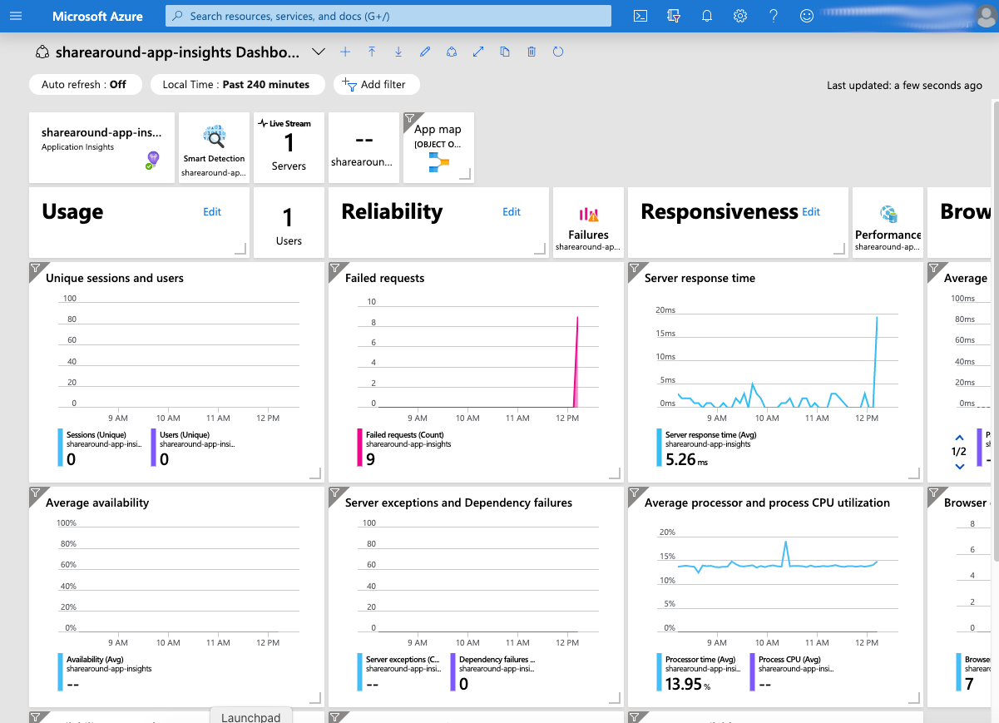
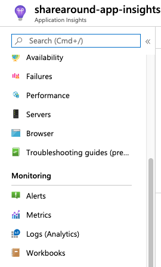
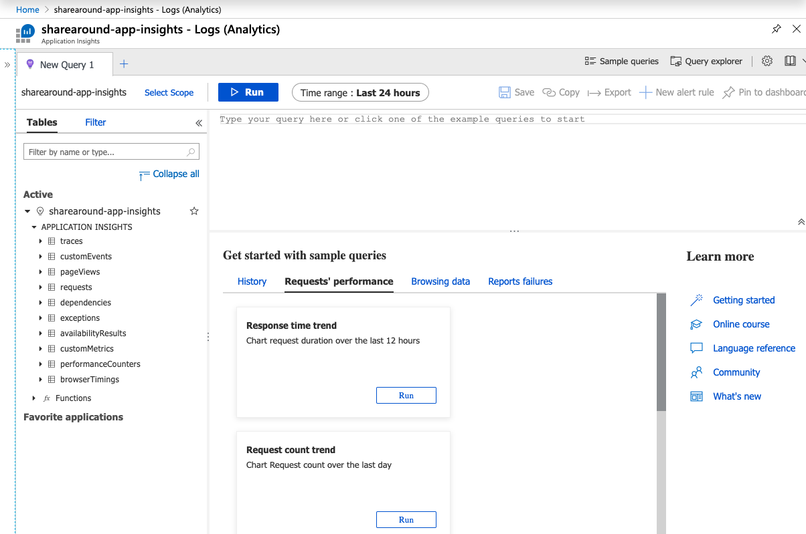

# Adding Application Insights

## What are we going to do in this step

In this step we are going to configure Application Insights so you can have more
insight into what your application is doing. For simplicity sake we are going to
ignore the fact that the application is using a database.

## Setting up

To start the migration we are going to copy the application from the `01-initial`
directory into this directory.

To do so please issue the following command line
in your terminal:

```shell
  mvn antrun:run@setup
```

## Build the web application

Now we are ready to build the web application.

Use the following command line:

```shell
mvn package
```

## Deploy the web application

To deploy the web application you will need a unique id as the URL space of
Azure App Service is shared across all Azure subscriptions . In a class room
setting ask your proctor what the value of the `<unique-id>` needs to be. If you
are doing this workshop by yourself you can omit the
`-DappName=sharearound-<unique-id>` and a unique id will be generated for you.

Use the following commandline:

```shell
  mvn azure-webapp:deploy -DappName=sharearound-<unique-id>
```

While this command is running, please feel free to review
[What is Application Insights?](https://docs.microsoft.com/en-us/azure/azure-monitor/app/app-insights-overview)

Once the command completes it will show you the URL of the deployed web
application, it will look similar to
`https://sharearound-<unique-id>.azurewebsites.net`. Please capture this URL as
you will need it later.

Open your browser to the shown URL to verify that you have successfully deployed
web application.

## Installing Application Insights Azure CLI extension

```shell
az extension add --name application-insights
```

## Create Application Insights application

We need to create the Application Insights application so we have a place we can
gather our insights to. Please execute the command line below:

```shell
az monitor app-insights component create --app sharearound-app-insights --resource-group sharearound --location westus2 --appliication-type java
```

Please capture the instrumentationKey as you will need it for later.

## Changes needed to the web application

Please add the following to the `<dependencies>` block in your `pom.xml` file.

```xml
<!-- Application Insights SDK -->
<dependency>
    <groupId>com.microsoft.azure</groupId>
    <artifactId>applicationinsights-web-auto</artifactId>
    <version>2.5.0</version>
</dependency>
```

## Create ApplicationInsights.xml

Create `src/main/resources/ApplicationInsights.xml` and paste the contents below
into that file and replace `**  Your instrumentation key **` with your
instrumentation key.

```xml
<?xml version="1.0" encoding="utf-8"?>
<ApplicationInsights xmlns="http://schemas.microsoft.com/ApplicationInsights/2013/Settings" schemaVersion="2014-05-30">
   <!-- The key from the portal: -->
   <InstrumentationKey>** Your instrumentation key **</InstrumentationKey>

   <!-- HTTP request component (not required for bare API) -->
   <TelemetryModules>
      <Add type="com.microsoft.applicationinsights.web.extensibility.modules.WebRequestTrackingTelemetryModule"/>
      <Add type="com.microsoft.applicationinsights.web.extensibility.modules.WebSessionTrackingTelemetryModule"/>
      <Add type="com.microsoft.applicationinsights.web.extensibility.modules.WebUserTrackingTelemetryModule"/>
   </TelemetryModules>

   <!-- Events correlation (not required for bare API) -->
   <!-- These initializers add context data to each event -->
   <TelemetryInitializers>
      <Add type="com.microsoft.applicationinsights.web.extensibility.initializers.WebOperationIdTelemetryInitializer"/>
      <Add type="com.microsoft.applicationinsights.web.extensibility.initializers.WebOperationNameTelemetryInitializer"/>
      <Add type="com.microsoft.applicationinsights.web.extensibility.initializers.WebSessionTelemetryInitializer"/>
      <Add type="com.microsoft.applicationinsights.web.extensibility.initializers.WebUserTelemetryInitializer"/>
      <Add type="com.microsoft.applicationinsights.web.extensibility.initializers.WebUserAgentTelemetryInitializer"/>
   </TelemetryInitializers>
</ApplicationInsights>
```

## Rebuild the web application

Now we are ready to rebuild the web application.

Use the following command line:

```shell
mvn package
```

## Redeploy the web application

To redeploy the web application you will need a unique id as the URL space of
Azure App Service is shared across all Azure subscriptions . In a class room
setting ask your proctor what the value of the `<unique-id>` needs to be. If you
are doing this workshop by yourself you can omit the
`-DappName=sharearound-<unique-id>` and a unique id will be generated for you.
You will also need the `instrumentationKey` you captured before.

Use the following commandline:

```shell
  mvn azure-webapp:deploy -DappName=sharearound-<unique-id>
```

While this command is running, please feel free to review
[What is Application Insights?](https://docs.microsoft.com/en-us/azure/azure-monitor/app/app-insights-overview)

Once the command completes it will show you the URL of the deployed web
application, it will look similar to
`https://sharearound-<unique-id>.azurewebsites.net`. Please capture this URL as
you will need it later.

Open your browser to the shown URL to verify that you have successfully deployed
web application. Please refresh the main page 10 times or so. Then click on the
link on the main page. It should trigger an error. Please refresh that page also
10 times or so.

## Looking at the Application Insights

Go to the [Azure Portal](https://portal.azure.com)

In the search bar enter `sharearound-app-insights` and press enter once to start
the search. Press enter a second time to go to the match found.


You should now see the Application Insights overview page for `sharearound-app-insights`.


If you want to drill down even more click on `Application Dashboard`.


The Application Dashboard will look similar to the image below:



## Looking at Log Analytics

It is possible to drill even further down by analyzing the logs that are collected.
To do so we are going to us Log Analytics.

In the search bar enter `sharearound-app-insights` and press enter once to start
the search. Press enter a second time to go to the match found.


Then in the left navigation area click on `Log (Analytics)`. You might have to scroll down to see it.



Once you click it you should see an image similar to the one below:

*If you get a message that Log Analytics is not enabled yet.
 please enable it*



In the area where it says 'Type your query here' enter the following:

```shell
requests
| limit 50
```

And then click the `Run` button above it. After a short while it should show you
an image similar to the one below.


You can drill down even more by clicking on any of those requests. But lets
continue on and select a slightly different query.

Replace the query with:

```shell
exceptions
| limit 50
```

This will show any of the exceptions that are happening.


You should see database exceptions, which are expected.

Now there is a whole lot more to Log Analytics, but the rest is left up to you!

For more information review [What is Application Insights?](https://docs.microsoft.com/en-us/azure/azure-monitor/app/app-insights-overview) and
[Overview of log queries in Azure Monitor](https://docs.microsoft.com/en-us/azure/azure-monitor/log-query/log-query-overview)

[Previous](../03-migrating-database/README.md)
