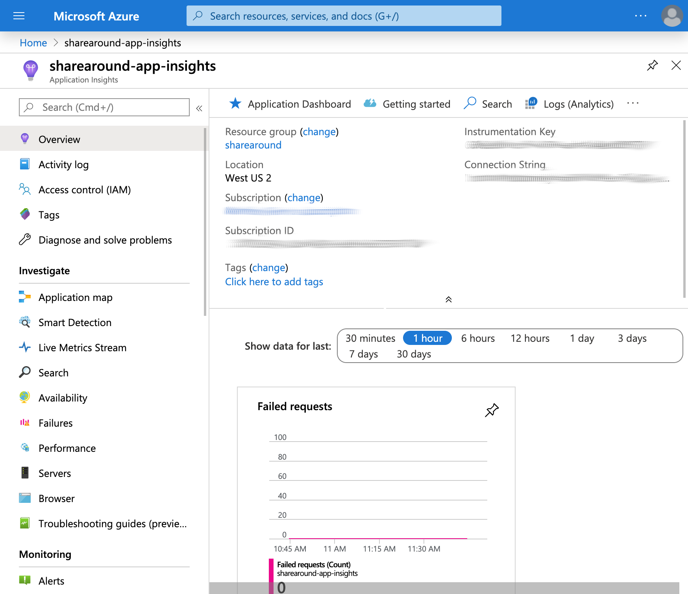
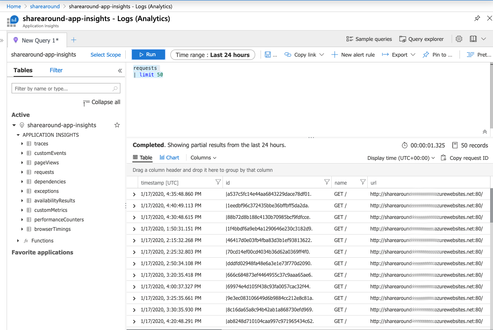
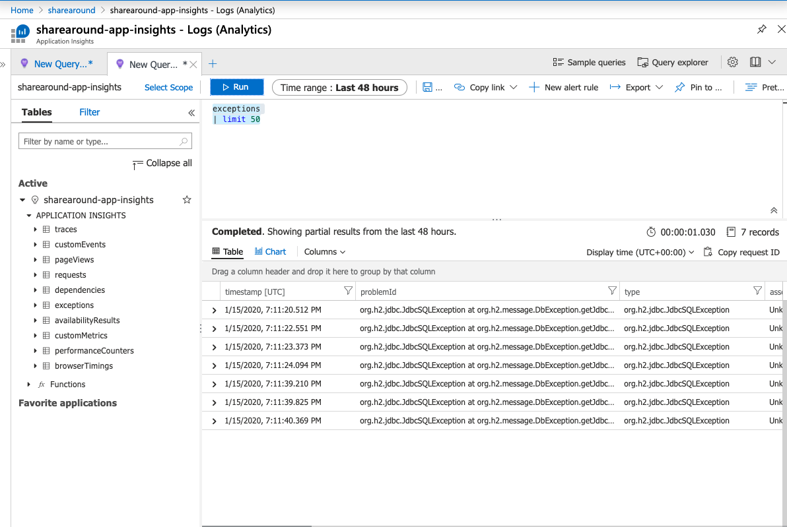

# Adding Application Insights

## Prerequisites

It is assumed you have completed the following steps:

1. [Setting up ACR](../02-setting-up-acr/README.md)
2. [Setting up AKS](../03-setting-up-aks/README.md)

## What are we going to do in this step

In this step we are going to configure Application Insights so you can have more
insight into what your application is doing. For simplicity sake we are going to
ignore the fact that the application is using a database.

## Setting up

To start the migration we are going to copy the application from the `01-initial`
directory into this directory.

To do so please issue the following command line
in your terminal:

```shell
  mvn antrun:run@setup
```

## Installing Application Insights Azure CLI extension

```shell
az extension add --name application-insights
```

## Create Application Insights application

We need to create the Application Insights application so we have a place we can
gather our insights to. Please execute the command line below:

```shell
az monitor app-insights component create --app sharearound-app-insights \
  --resource-group sharearound --location westus2 --application-type java
```

Please capture the instrumentationKey as you will need it for later.

## Changes needed to the web application

Please add the following to the `<dependencies>` block in your `pom.xml` file.

```xml
<!-- Application Insights SDK -->
<dependency>
    <groupId>com.microsoft.azure</groupId>
    <artifactId>applicationinsights-web-auto</artifactId>
    <version>2.5.0</version>
</dependency>
```

## Create ApplicationInsights.xml

Create `src/main/resources/ApplicationInsights.xml` and paste the contents below
into that file and replace `**  Your instrumentation key **` with your
instrumentation key.

```xml
<?xml version="1.0" encoding="utf-8"?>
<ApplicationInsights xmlns="http://schemas.microsoft.com/ApplicationInsights/2013/Settings" schemaVersion="2014-05-30">
   <!-- The key from the portal / CLI: -->
   <InstrumentationKey>** Your instrumentation key **</InstrumentationKey>

   <!-- HTTP request component (not required for bare API) -->
   <TelemetryModules>
      <Add type="com.microsoft.applicationinsights.web.extensibility.modules.WebRequestTrackingTelemetryModule"/>
      <Add type="com.microsoft.applicationinsights.web.extensibility.modules.WebSessionTrackingTelemetryModule"/>
      <Add type="com.microsoft.applicationinsights.web.extensibility.modules.WebUserTrackingTelemetryModule"/>
   </TelemetryModules>

   <!-- Events correlation (not required for bare API) -->
   <!-- These initializers add context data to each event -->
   <TelemetryInitializers>
      <Add type="com.microsoft.applicationinsights.web.extensibility.initializers.WebOperationIdTelemetryInitializer"/>
      <Add type="com.microsoft.applicationinsights.web.extensibility.initializers.WebOperationNameTelemetryInitializer"/>
      <Add type="com.microsoft.applicationinsights.web.extensibility.initializers.WebSessionTelemetryInitializer"/>
      <Add type="com.microsoft.applicationinsights.web.extensibility.initializers.WebUserTelemetryInitializer"/>
      <Add type="com.microsoft.applicationinsights.web.extensibility.initializers.WebUserAgentTelemetryInitializer"/>
   </TelemetryInitializers>
</ApplicationInsights>
```

## Build the web application

Now we are ready to build the web application.

Use the following command line:

```shell
mvn package
```

## Build the image on ACR

Since our AKS cluster needs to be able to pull the image from a Docker registry
we are going to build it using Azure CLI and target our ACR.

Execute the following command line to do so:

```shell
az acr build --registry sharearoundacr$UNIQUE_ID --image sharearound \
  --file src/main/aks/Dockerfile .
```

1m

## Deploy to the AKS cluster

Determine the name of your ACR by executing the following command line:

```shell
echo sharearoundacr$UNIQUE_ID
```

Now open `src/main/aks/sharearound.yml` in your editor and replace REGISTRY with
the value of the previous command (which is the name of your ACR).

And then finally deploy the application by using the following command line:

```shell
kubectl apply -f src/main/aks/sharearound.yml
```

The command will quickly return, but the deployment will still be going on.

We are going to use `kubectl` to wait for the service to become available:

Execute the following command line:

```shell
kubectl get service/sharearound --output wide -w
```

Now wait until you see the EXTERNAL-IP column populated with an IP address.

> Note if the command does not show the EXTERNAL-IP after a long while, please
> use `Ctrl+C` to cancel the command and then reissue the command without `-w`.

Once the IP address is there you are ready to open Microsoft Edge to
`http://EXTERNAL-IP:8080/`. Please refresh the main page 10 times or so. Then
click on the link on the main page. It should trigger an error. Please refresh
that page also 10 times or so.

## Looking at the Application Insights

Go to the [Azure Portal](https://portal.azure.com)

In the search bar enter `sharearound-app-insights` and press enter once to start
the search. Press enter a second time to go to the match found.


You should now see the Application Insights overview page for `sharearound-app-insights`.



If you want to drill down even more click on `Application Dashboard`.


The Application Dashboard will look similar to the image below:


## Looking at Log Analytics

It is possible to drill even further down by analyzing the logs that are collected.

To do so we are going to use Log Analytics.

In the search bar enter `sharearound-app-insights` and press enter once to start
the search. Press enter a second time to go to the match found.


Then in the left navigation area click on `Log (Analytics)`. You might have to scroll down to see it.


Once you click it you should see an image similar to the one below:


In the area where it says 'Type your query here' enter the following:

```shell
requests
| limit 50
```

And then click the `Run` button above it. After a short while it should show you
an image similar to the one below.



You can drill down even more by clicking on any of those requests. But lets
continue on and select a slightly different query.

Replace the query with:

```shell
exceptions
| limit 50
```

This will show any of the exceptions that are happening.



You should see database exceptions, which are expected.

Click on `>` next to any of the exceptions to drill down to see what the problem
is.

In the `innermostMessage` you should see something similar to the following:

```log
Table "ITEM" not found; SQL statement:
select item0_.id as id1_0_, item0_.short_description as short_de2_0_, item0_.title as title3_0_ from item item0_ [42102-193]
```

Remember at the beginning of this step we told you that we are purposely ignoring
the database. Here the message is telling you the database does NOT have the
proper table.

## What did you accomplish

1. You have created an Application Insights resource.
1. You have added Application Insights to the web application.
1. You have build the Docker image with WildFly and your application.
1. You have deployed the Docker image to AKS.
1. You have verified the web application works on AKS.
1. You have explored Application Insights a bit.
1. You have explored Log Analytics a bit.

## More information

1. [What is Application Insights?](https://docs.microsoft.com/en-us/azure/azure-monitor/app/app-insights-overview)
1. [Azure CLI command for Application Insights](https://docs.microsoft.com/en-us/cli/azure/ext/application-insights/monitor/app-insights?view=azure-cli-latest)
1. [Overview of log queries in Azure Monitor](https://docs.microsoft.com/en-us/azure/azure-monitor/log-query/log-query-overview)
1. [Azure CLI commands for ACR](https://docs.microsoft.com/en-us/cli/azure/acr?view=azure-cli-latest)
1. [Kubectl Reference Documentation](https://kubernetes.io/docs/reference/generated/kubectl/kubectl-commands)

[Previous](../04-migrating-web-pages/README.md) &nbsp; [Next](../06-migrating-database/README.md)

10m
